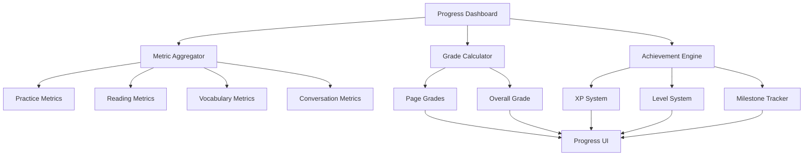

# Progress Page System - AIdioma v2

## 🎯 System Overview

The Progress Page System is a comprehensive grading and achievement tracking module that provides multi-dimensional performance analytics across all learning activities. This system builds upon our existing stats infrastructure to deliver meaningful progress insights and gamified learning experiences.

---

## 📊 Core Architecture

### **System Components**



### **Data Flow Architecture**

```typescript
interface ProgressSystemArchitecture {
  dataCollection: {
    source: 'All Practice Pages',
    frequency: 'Real-time',
    storage: 'Local Storage + API Sync'
  };
  
  processing: {
    metrics: 'Multi-dimensional calculation',
    grading: 'Weighted scoring algorithm',
    achievements: 'Event-driven triggers'
  };
  
  presentation: {
    dashboard: 'Unified progress overview',
    pageStats: 'Enhanced stats bars',
    notifications: 'Achievement alerts'
  };
}
```

---

## 🔢 Metric Categories

### **1. Practice Mastery (Practice Page)**
```typescript
interface PracticeMetrics {
  // Quantity Metrics
  sentencesPracticed: number;        // Total attempts
  sessionsCompleted: number;         // Learning sessions
  
  // Quality Metrics  
  accuracyRate: number;              // 0-100% correct responses
  independenceScore: number;         // % completed without hints
  grammarConceptsMastered: string[]; // Concepts understood
  
  // Efficiency Metrics
  averageResponseTime: number;       // Seconds per sentence
  improvementRate: number;           // Week-over-week progress
  
  // Consistency Metrics
  consecutiveCorrect: number;        // Current streak
  dailyPracticeStreak: number;       // Days of consistent practice
}
```

**Grading Formula**:
```typescript
function calculatePracticeGrade(metrics: PracticeMetrics): number {
  const accuracy = metrics.accuracyRate * 0.4;
  const independence = metrics.independenceScore * 0.3;
  const speed = getSpeedBonus(metrics.averageResponseTime) * 0.2;
  const consistency = Math.min(metrics.consecutiveCorrect / 10, 1) * 0.1;
  
  return Math.round(accuracy + independence + speed + consistency);
}
```

### **2. Reading Comprehension (Reading Page)**
```typescript
interface ReadingMetrics {
  // Quantity Metrics
  wordsEncountered: number;          // Total words seen
  paragraphsCompleted: number;       // Content consumed
  textsCompleted: number;            // Full articles/stories read
  
  // Learning Metrics
  wordsClickedForHelp: number;       // Words needing assistance
  newWordsLearned: number;           // Words learned from context
  
  // Efficiency Metrics
  readingSpeed: number;              // Words per minute
  comprehensionRate: number;         // Understanding % from quizzes
  
  // Growth Metrics
  contentDifficultyProgression: number; // Difficulty level increase
  vocabularyGrowthRate: number;      // New words per session
}
```

### **3. Vocabulary Retention (Memorize Page)**
```typescript
interface VocabularyMetrics {
  // Achievement Metrics
  wordsMemorized: number;            // Successfully learned words
  wordsInProgress: number;           // Currently learning
  
  // Quality Metrics
  retentionRate: number;             // % remembered after 24h+
  masteryDepth: number;              // Understanding across contexts
  
  // Engagement Metrics
  flashcardsReviewed: number;        // Total reviews
  spacedRepetitionStreak: number;    // Daily review habit
  
  // Efficiency Metrics
  averageTriesToMaster: number;      // Attempts before mastery
  reviewEfficiency: number;          // Correct answers per review
}
```

### **4. Conversation Fluency (Chat Page)**
```typescript
interface ConversationMetrics {
  // Quantity Metrics
  messagesExchanged: number;         // Total interactions
  conversationsCompleted: number;    // Full conversation sessions
  
  // Quality Metrics
  grammarImprovementRate: number;    // Reduction in corrections
  vocabularyVariety: number;         // Unique words used
  culturalContextUsage: number;      // Idiomatic expressions
  
  // Engagement Metrics
  averageConversationLength: number; // Messages per conversation
  topicsDiversified: number;         // Different conversation topics
  
  // Fluency Metrics
  responseTime: number;              // Average message response time
  complexityProgression: number;     // Sentence structure improvement
}
```

---

## 🏆 Achievement System

### **Cross-Page Achievement Definitions**
```typescript
interface AchievementMilestones {
  // Vocabulary Mastery
  vocabulary_novice: {
    threshold: 50,
    title: "Word Explorer",
    description: "Memorized 50 Spanish words",
    xpReward: 100,
    badge: "🌟"
  };
  
  vocabulary_learner: {
    threshold: 200,
    title: "Vocabulary Builder", 
    description: "Memorized 200 Spanish words",
    xpReward: 300,
    badge: "📚"
  };
  
  vocabulary_intermediate: {
    threshold: 500,
    title: "Word Master",
    description: "Memorized 500 Spanish words", 
    xpReward: 750,
    badge: "🎯"
  };
  
  vocabulary_advanced: {
    threshold: 1000,
    title: "Vocabulario Experto",
    description: "Memorized 1000+ Spanish words",
    xpReward: 1500,
    badge: "👑"
  };
  
  // Practice Consistency
  practice_streak_week: {
    threshold: 7,
    title: "Dedicated Learner",
    description: "7 days of consistent practice",
    xpReward: 200,
    badge: "🔥"
  };
  
  practice_perfectionist: {
    threshold: 50,
    title: "Precision Master", 
    description: "50 sentences with 100% accuracy",
    xpReward: 400,
    badge: "💎"
  };
  
  // Reading Progress
  reading_bookworm: {
    threshold: 10,
    title: "Spanish Reader",
    description: "Completed 10 Spanish texts",
    xpReward: 350,
    badge: "📖"
  };
  
  reading_speed_demon: {
    threshold: 150,
    title: "Speed Reader",
    description: "Reading at 150+ WPM",
    xpReward: 250,
    badge: "⚡"
  };
  
  // Cross-Page Excellence
  polyglot_apprentice: {
    requirement: "80%+ average across all pages",
    title: "Polyglot Apprentice",
    description: "Excellence across all learning areas",
    xpReward: 1000,
    badge: "🌍"
  };
}
```

### **XP Point System**
```typescript
const XP_REWARDS = {
  // Practice Page
  sentence_perfect: 10,      // 100% accuracy, no hints
  sentence_good: 5,          // 80%+ accuracy  
  hint_independence: 3,      // Complete without hints
  grammar_mastery: 25,       // Master new grammar concept
  
  // Reading Page
  paragraph_completed: 8,    // Finish paragraph
  word_learned_context: 5,   // Learn word from reading
  comprehension_high: 10,    // 90%+ comprehension quiz
  text_completed: 50,        // Complete full text
  
  // Memorize Page
  flashcard_mastered: 15,    // Word moved to "known"
  review_session_complete: 20, // Complete daily review
  retention_streak: 5,       // Remember word after 7+ days
  perfect_review: 30,        // 100% accuracy in review session
  
  // Chat Page
  conversation_completed: 25, // Complete conversation
  grammar_improvement: 8,    // Fewer corrections than previous
  vocabulary_used: 3,        // Use newly learned word in chat
  cultural_expression: 15,   // Use idiomatic expression
  
  // Daily Milestones
  daily_streak: 50,          // Complete all activities in one day
  weekly_goal: 100,          // Meet weekly learning target
  cross_page_mastery: 200,   // Excel across all pages same day
};
```

---

## 📈 Grading System

### **Individual Page Grades**
```typescript
interface GradeCalculation {
  letter: string;
  percentage: number;
  color: string;
  description: string;
  feedback: string;
}

function calculatePageGrade(metrics: PageMetrics): GradeCalculation {
  const score = weightedAverage(metrics);
  
  if (score >= 95) return {
    letter: 'A+', 
    percentage: score,
    color: '#10B981', 
    description: 'Exceptional',
    feedback: '¡Excelente! Outstanding mastery of Spanish.'
  };
  
  if (score >= 90) return {
    letter: 'A', 
    percentage: score,
    color: '#059669', 
    description: 'Excellent',
    feedback: '¡Muy bien! Excellent progress in your learning.'
  };
  
  if (score >= 85) return {
    letter: 'B+', 
    percentage: score,
    color: '#0891B2', 
    description: 'Very Good',
    feedback: '¡Bien hecho! Very good understanding.'
  };
  
  if (score >= 80) return {
    letter: 'B', 
    percentage: score,
    color: '#0284C7', 
    description: 'Good',
    feedback: 'Good progress. Keep practicing!'
  };
  
  if (score >= 75) return {
    letter: 'C+', 
    percentage: score,
    color: '#7C3AED', 
    description: 'Above Average',
    feedback: 'Above average. Focus on weak areas.'
  };
  
  if (score >= 70) return {
    letter: 'C', 
    percentage: score,
    color: '#8B5CF6', 
    description: 'Average',
    feedback: 'Average performance. More practice needed.'
  };
  
  if (score >= 65) return {
    letter: 'D+', 
    percentage: score,
    color: '#F59E0B', 
    description: 'Below Average',
    feedback: 'Below average. Consider reviewing basics.'
  };
  
  if (score >= 60) return {
    letter: 'D', 
    percentage: score,
    color: '#D97706', 
    description: 'Needs Work',
    feedback: 'Needs improvement. Focus on fundamentals.'
  };
  
  return {
    letter: 'F', 
    percentage: score,
    color: '#DC2626', 
    description: 'Needs Significant Improvement',
    feedback: 'Significant improvement needed. Consider additional support.'
  };
}
```

### **Overall Grade Calculation**
```typescript
function calculateOverallGrade(pageGrades: PageGrades): GradeCalculation {
  const weights = {
    practice: 0.35,    // Core learning activity
    reading: 0.25,     // Comprehension skills  
    memorize: 0.25,    // Vocabulary building
    conversation: 0.15 // Applied fluency
  };
  
  const weightedScore = (
    pageGrades.practice.percentage * weights.practice +
    pageGrades.reading.percentage * weights.reading +
    pageGrades.memorize.percentage * weights.memorize +
    pageGrades.conversation.percentage * weights.conversation
  );
  
  return calculatePageGrade({ percentage: weightedScore });
}
```

---

## 🎮 Level System

### **Learner Progression Levels**
```typescript
interface LearnerLevel {
  id: string;
  title: string;
  titleSpanish: string;
  xpRequired: number;
  benefits: string[];
  unlocks: string[];
  badge: string;
}

const PROGRESSION_LEVELS: LearnerLevel[] = [
  {
    id: 'beginner',
    title: 'Beginner',
    titleSpanish: 'Principiante',
    xpRequired: 0,
    benefits: ['Basic practice unlocked', 'Simple vocabulary'],
    unlocks: ['Practice Page access'],
    badge: '🌱'
  },
  
  {
    id: 'student', 
    title: 'Student',
    titleSpanish: 'Estudiante',
    xpRequired: 500,
    benefits: ['Reading content unlocked', 'Flashcard system'],
    unlocks: ['Reading Page', 'Memorize Page'],
    badge: '📚'
  },
  
  {
    id: 'conversationalist',
    title: 'Conversationalist', 
    titleSpanish: 'Conversador',
    xpRequired: 1500,
    benefits: ['Chat practice unlocked', 'AI conversations'],
    unlocks: ['Conversations Page', 'Grammar corrections'],
    badge: '💬'
  },
  
  {
    id: 'intermediate',
    title: 'Intermediate',
    titleSpanish: 'Intermedio', 
    xpRequired: 3000,
    benefits: ['Advanced content', 'Cultural contexts'],
    unlocks: ['Complex texts', 'Idiomatic expressions'],
    badge: '🎯'
  },
  
  {
    id: 'advanced',
    title: 'Advanced',
    titleSpanish: 'Avanzado',
    xpRequired: 6000,
    benefits: ['Expert content', 'Native-level materials'],
    unlocks: ['Literature', 'News articles', 'Podcasts'],
    badge: '⭐'
  },
  
  {
    id: 'expert',
    title: 'Expert', 
    titleSpanish: 'Experto',
    xpRequired: 10000,
    benefits: ['Teaching mode', 'Community features'],
    unlocks: ['Help other learners', 'Create content'],
    badge: '👑'
  }
];
```

---

## 🖥️ UI Components

### **Main Progress Dashboard**
```typescript
interface ProgressDashboardProps {
  user: User;
  overallGrade: GradeCalculation;
  currentLevel: LearnerLevel;
  xpProgress: XPProgress;
  pageGrades: PageGrades;
  weeklyStats: WeeklyStats;
  recentAchievements: Achievement[];
  nextMilestones: Milestone[];
}

interface WeeklyStats {
  wordsMemorized: number;        // New this week
  sentencesPracticed: number;    // Total this week  
  readingTime: number;           // Minutes this week
  conversationCount: number;     // Conversations this week
  xpEarned: number;             // XP gained this week
  streakDays: number;           // Consecutive days active
}
```

### **Enhanced Metric Cards**
```typescript
interface MetricCard {
  icon: string;           // Emoji or icon
  value: string | number; // Primary metric
  label: string;          // Metric description
  progress?: number;      // 0-100 progress bar
  color: string;          // Theme color
  trend?: string;         // "+23 this week"
  grade?: string;         // "A-" grade display
  onClick?: () => void;   // Navigation to detail
}

// Example implementation matching current design
<MetricCard
  icon="🎯"
  value="847"
  label="Words Memorized"
  progress={78}
  color="purple"
  trend="+23 this week"
  grade="A-"
  onClick={() => navigate('/memorize')}
/>
```

### **Achievement Notification System**
```typescript
interface AchievementNotification {
  achievement: Achievement;
  xpGained: number;
  levelUp?: boolean;
  newLevel?: LearnerLevel;
  showDuration: number; // milliseconds
}

// Real-time achievement popup
function AchievementPopup({ achievement, xpGained, levelUp }: AchievementNotification) {
  return (
    <div className="achievement-popup animate-slide-up">
      <div className="achievement-content">
        <span className="achievement-badge">{achievement.badge}</span>
        <h3>{achievement.title}</h3>
        <p>{achievement.description}</p>
        <div className="xp-gained">+{xpGained} XP</div>
        {levelUp && (
          <div className="level-up">¡Level Up! 🎉</div>
        )}
      </div>
    </div>
  );
}
```

---

## 🔄 Implementation Roadmap

### **Phase 1: Foundation (Week 1-2)**
- [ ] Set up progress data models and storage
- [ ] Implement basic metric collection from existing pages
- [ ] Create XP point system infrastructure
- [ ] Build achievement trigger system

### **Phase 2: Core Features (Week 3-4)**  
- [ ] Develop grading calculation algorithms
- [ ] Implement level progression system
- [ ] Create progress dashboard UI components
- [ ] Build achievement notification system

### **Phase 3: Enhancement (Week 5-6)**
- [ ] Add cross-page achievement tracking
- [ ] Implement weekly/monthly progress reports
- [ ] Create milestone celebration features
- [ ] Add social sharing capabilities

### **Phase 4: Optimization (Week 7-8)**
- [ ] Performance optimization for real-time updates
- [ ] Advanced analytics and insights
- [ ] Personalized learning recommendations
- [ ] A/B testing for gamification elements

---

## 🎯 Success Metrics

### **User Engagement Metrics**
- **Session Length**: Average time spent per learning session
- **Return Rate**: Daily/weekly active user retention
- **Page Utilization**: Usage distribution across practice pages
- **Achievement Rate**: Percentage of milestones reached

### **Learning Effectiveness Metrics**
- **Skill Progression**: Grade improvements over time
- **Knowledge Retention**: Long-term vocabulary recall
- **Mastery Depth**: Understanding across different contexts
- **Real-world Application**: Conversation fluency improvement

### **System Performance Metrics**
- **Response Time**: Real-time metric calculation speed
- **Data Accuracy**: Precision of progress tracking
- **User Satisfaction**: Progress system usefulness ratings
- **Feature Adoption**: Usage of new progress features

---

This comprehensive Progress Page System transforms learning analytics into an engaging, motivational experience that drives continued Spanish language mastery! 🚀
